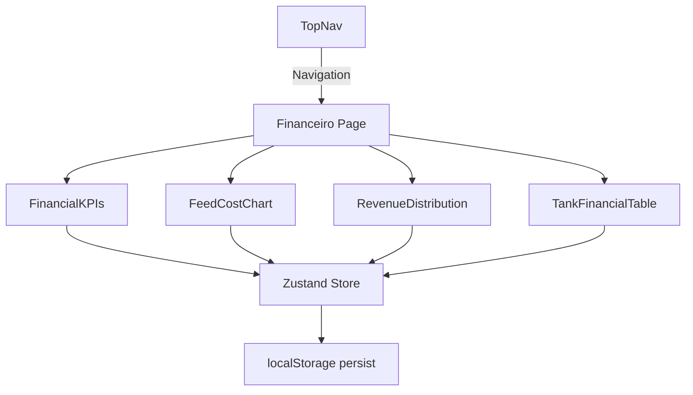

# Financial Dashboard — Architecture Plan

## Overview

A new page at `/financeiro` that provides a comprehensive financial overview of the entire fish farming operation, with per-tank breakdowns and visual charts.

## Page Structure

```
app/financeiro/page.tsx          — Main page component
components/Financeiro/
  ├── FinancialKPIs.tsx          — Top-level KPI cards (Revenue, Costs, Profit, Margin)
  ├── TankFinancialTable.tsx     — Detailed table with per-tank financial data
  ├── FeedCostChart.tsx          — Bar chart: feed costs by phase
  ├── RevenueDistribution.tsx    — Pie/donut chart: revenue by tank module
  └── ProfitabilityGauge.tsx     — Visual gauge showing profit margin
```

## Data Model (derived from existing store)

### Per-Tank Financial Calculations

For each tank with an active batch, we compute:

| Metric | Formula |
|--------|---------|
| **Feed Cost (monthly)** | `racao_mes_sc * bag_price` (bag price derived from custos) |
| **Estimated Revenue** | `peso_total_kg * premissas.preco_venda` |
| **Profit** | `revenue - feed_cost` |
| **Density Efficiency** | `densidade_kg_m2 / max_density_for_phase` |

### Global Aggregations

| KPI | Source |
|-----|--------|
| Total Revenue | `custos.receita_venda` |
| Total Feed Cost | `custos.custo_racao` |
| Other Expenses | `custos.outras_despesas` |
| Net Profit | `revenue - feed_cost - other_expenses` |
| Profit Margin | `(profit / revenue) * 100` |
| Total Fish | Sum of all `qtd_peixes` across phases |
| Total Biomass | Sum of all `peso_total_kg` across phases |
| Monthly Feed | Sum of all `racao_mes_sc` across phases |

## Charting Strategy

Since no charting library is currently installed, we have two options:

### Option A: Install Recharts (Recommended)
- Lightweight, React-native charting library
- Good TypeScript support
- Components: `BarChart`, `PieChart`, `Tooltip`, `Legend`

### Option B: Pure CSS/SVG Charts
- No additional dependencies
- Custom-built bar charts and donut charts using CSS
- Lighter bundle but more manual work

**Recommendation**: Use Option A (Recharts) for professional-looking charts with minimal effort.

## Navigation Change

Update [`TopNav.tsx`](components/TopNav.tsx:9) to add a third nav item:

```typescript
const navItems = [
  { href: '/', label: 'Visão Geral', icon: Home },
  { href: '/premissas', label: 'Premissas', icon: Target },
  { href: '/financeiro', label: 'Financeiro', icon: DollarSign },  // NEW
];
```

## Page Layout Wireframe

```
┌─────────────────────────────────────────────────────────────┐
│  TopNav:  AquaGest | Visão Geral | Premissas | Financeiro   │
├─────────────────────────────────────────────────────────────┤
│                                                             │
│  Financial Dashboard Header                                 │
│  ┌──────────┐ ┌──────────┐ ┌──────────┐ ┌──────────┐      │
│  │ Revenue  │ │ Costs    │ │ Profit   │ │ Margin   │      │
│  │ R$ 1.44M │ │ R$ 750K  │ │ R$ 440K  │ │ 30.5%    │      │
│  └──────────┘ └──────────┘ └──────────┘ └──────────┘      │
│                                                             │
│  ┌─────────────────────────┐ ┌─────────────────────────┐   │
│  │ Feed Cost by Phase      │ │ Revenue by Tank/Module  │   │
│  │ [Bar Chart]             │ │ [Donut Chart]           │   │
│  └─────────────────────────┘ └─────────────────────────┘   │
│                                                             │
│  ┌─────────────────────────────────────────────────────┐   │
│  │ Per-Tank Financial Breakdown                        │   │
│  │ ┌──────┬────────┬────────┬────────┬────────┬─────┐ │   │
│  │ │ Tank │ Phase  │ Fish   │ Biomass│ Revenue│ Cost│ │   │
│  │ ├──────┼────────┼────────┼────────┼────────┼─────┤ │   │
│  │ │ T03  │ Engorda│ 6,000  │ 15,000 │ R$...  │ ... │ │   │
│  │ │ T04  │ Engorda│ 9,000  │ 22,500 │ R$...  │ ... │ │   │
│  │ │ ...  │ ...    │ ...    │ ...    │ ...    │ ... │ │   │
│  │ └──────┴────────┴────────┴────────┴────────┴─────┘ │   │
│  └─────────────────────────────────────────────────────┘   │
│                                                             │
└─────────────────────────────────────────────────────────────┘
```

## Implementation Steps

1. **Install Recharts** — `npm install recharts`
2. **Create page** at `app/financeiro/page.tsx`
3. **Update TopNav** — add "Financeiro" link
4. **Create components** in `components/Financeiro/`
5. **Wire up data** from Zustand store
6. **Test** — verify navigation and data display

## Mermaid Architecture Diagram


